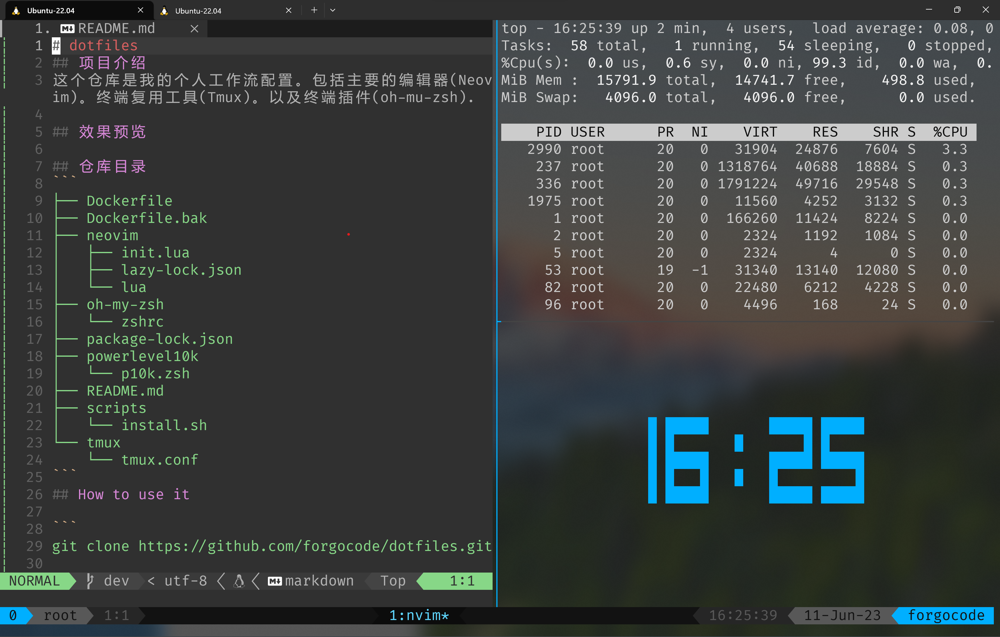
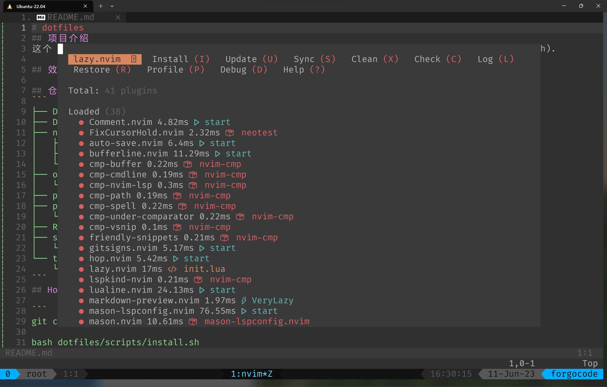

# dotfiles
## 项目介绍
这个仓库是我的个人工作流配置。包括主要的编辑器(Neovim)。终端复用工具(Tmux)。以及终端插件(oh-mu-zsh).

## 效果预览



## 📇仓库目录
```
├── Dockerfile
├── Dockerfile.bak
├── neovim
│   ├── init.lua
│   ├── lazy-lock.json
│   └── lua
├── oh-my-zsh
│   └── zshrc
├── package-lock.json
├── powerlevel10k
│   └── p10k.zsh
├── README.md
├── scripts
│   └── install.sh
└── tmux
    └── tmux.conf
```
## 🛠怎么使用

```
git clone https://github.com/ricky97gr/dotfiles.git

bash dotfiles/scripts/install.sh
```

## 📝Tips
- dev分支处于开发分支，master是主分支，你可以按需使用
- 仓库的代码处于不定时更新中
- 未完待续...
